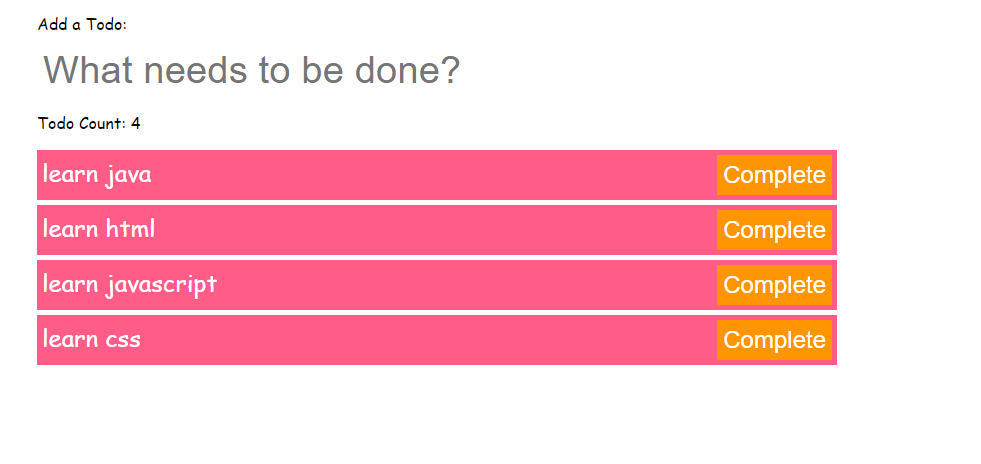

## Todo App
### created a todo App using vanilla javascript and local storage 
This application was built plainly using htm,css and javascript
No databse was created for this app to store information
The application uses only loacl storage to set the item and retriev it during
the runtime
## Mockup
the following screenshot shows overview of the application

